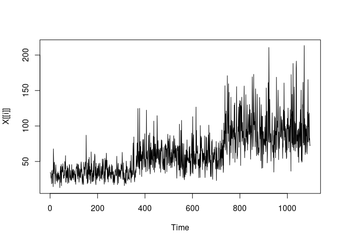
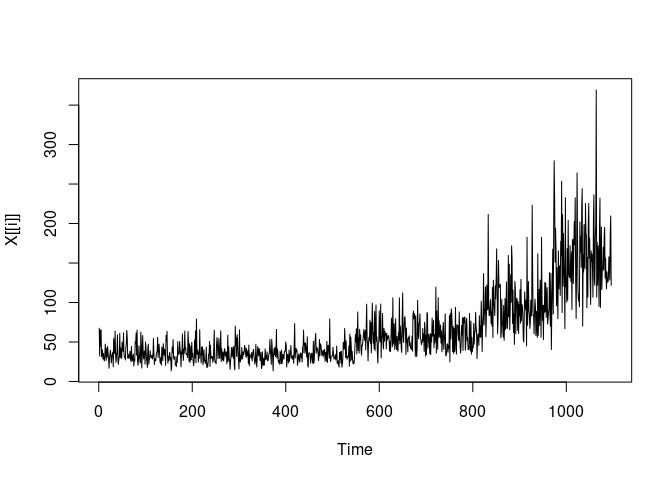
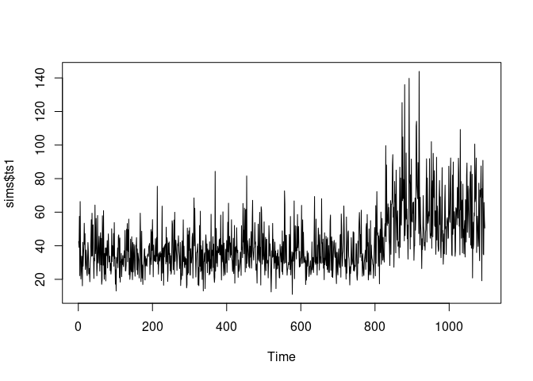
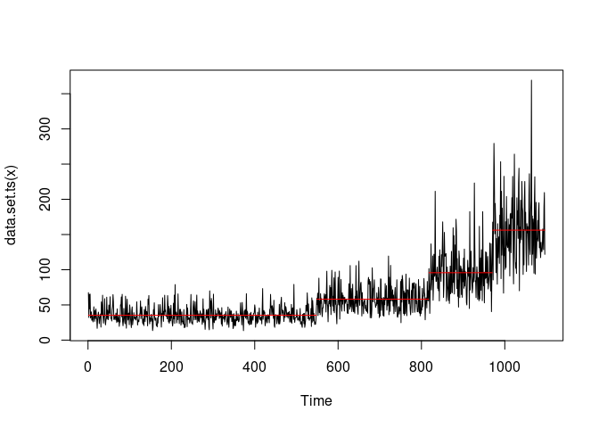

# BayesianMDLGA

<!-- badges: start -->
[](https://github.com/c-taimal/BayesianMDLGA/actions/workflows/R-CMD-check.yaml)
<!-- badges: end -->

## Usage

``` r
remotes::install_github("c-taimal/BayesianMDLGA")
```

``` r
library(BayesianMDLGA)
```

``` r
str(rlnorm_ts_1)
```

    ##  Time-Series [1:1096] from 1 to 1096: 42.6 39.1 57.5 22.2 66.3 ...

``` r
str(param)
```

    ## List of 31
    ##  $ frecuencia_datos       : num 7
    ##  $ n_datos                : chr "TODOS"
    ##  $ diarios0_rebases1      : num 0
    ##  $ r                      : num 50
    ##  $ k                      : num 50
    ##  $ penalty                : chr "BMDL"
    ##  $ max_num_cp             : num 20
    ##  $ prob_inicial           : num 0.06
    ##  $ prob_volado            : num 0.5
    ##  $ probs_muta             : num [1:3] 0.3 0.4 0.3
    ##  $ mutaciones             : num [1:3] -1 0 1
    ##  $ dist_extremos          : num 10
    ##  $ prob_para_sin_cp       : num 0.5
    ##  $ cp_real                : chr "sin cp_real"
    ##  $ quita_ini0_fin1        : num 0
    ##  $ probs_rank0_MDL1       : num 0
    ##  $ nombre_carpeta_pdf     : chr "Figures"
    ##  $ nombre_carpeta_RData   : chr "Data"
    ##  $ cuantos_mejores_cp_graf: num 100
    ##  $ my_data                : NULL
    ##  $ minimo_numero_de_cp    : num 1
    ##  $ probs_nuevos_muta0N    : num [1:3] 0.8 0.1 0.1
    ##  $ rf_type                : chr "W"
    ##  $ initial_val_optim      : num [1:2] 0.1 0.5
    ##  $ mat_low_upp            : num [1:2, 1:2] 1e-04 1e-08 1e+01 1e+05
    ##  $ vec_dist_a_priori      : chr [1:2] "Gamma" "Gamma"
    ##  $ mat_phi                : num [1:2, 1:2] 1 3 2 1.2
    ##  $ ajuste_bloque          : logi TRUE
    ##  $ print_progress_bar     : logi TRUE
    ##  $ print_progress_plots   : logi TRUE
    ##  $ value_set_seed         : num 123

``` r
str(pm_25)
```

    ## Classes 'spec_tbl_df', 'tbl_df', 'tbl' and 'data.frame': 1096 obs. of  1 variable:
    ##  $ PM2.5: num  393 277 303 336 329 201 237 235 292 276 ...
    ##  - attr(*, "spec")=List of 3
    ##   ..$ cols   :List of 1
    ##   .. ..$ PM2.5: list()
    ##   .. .. ..- attr(*, "class")= chr [1:2] "collector_number" "collector"
    ##   ..$ default: list()
    ##   .. ..- attr(*, "class")= chr [1:2] "collector_guess" "collector"
    ##   ..$ delim  : chr ","
    ##   ..- attr(*, "class")= chr "col_spec"
    ##  - attr(*, "problems")=<externalptr>

``` r
summary(pm_25)
```

    ##      PM2.5      
    ##  Min.   : 13.0  
    ##  1st Qu.:207.0  
    ##  Median :300.0  
    ##  Mean   :288.3  
    ##  3rd Qu.:377.0  
    ##  Max.   :785.0

``` r
list(rlnorm_ts_1, rlnorm_ts_2, rlnorm_ts_3) |>
  lapply(plot)
```

<!-- --><!-- --><!-- -->

    ## [[1]]
    ## NULL
    ## 
    ## [[2]]
    ## NULL
    ## 
    ## [[3]]
    ## NULL

``` r
AG_BMDL_r_paso(DataCPSimRebases, param)
AG_BMDL_r_paso(rlnorm_ts_3, param)
```

## `changepoint`

``` r
plot(rlnorm_ts_3)
library(changepoint)
```

<!-- -->

``` r
list(rlnorm_ts_1, rlnorm_ts_2, rlnorm_ts_3) |>
  lapply(cpt.meanvar, method = "PELT") |>
  str()
```

    ## List of 3
    ##  $ :Formal class 'cpt' [package "changepoint"] with 12 slots
    ##   .. ..@ data.set : Time-Series [1:1096] from 1 to 1096: 42.6 39.1 57.5 22.2 66.3 ...
    ##   .. ..@ cpttype  : chr "mean and variance"
    ##   .. ..@ method   : chr "PELT"
    ##   .. ..@ test.stat: chr "Normal"
    ##   .. ..@ pen.type : chr "MBIC"
    ##   .. ..@ pen.value: num 28
    ##   .. ..@ minseglen: num 2
    ##   .. ..@ cpts     : int [1:2] 826 1096
    ##   .. ..@ ncpts.max: num Inf
    ##   .. ..@ param.est:List of 2
    ##   .. .. ..$ mean    : num [1:2] 35.6 60
    ##   .. .. ..$ variance: num [1:2] 128 424
    ##   .. ..@ date     : chr "Thu Jun  8 14:09:02 2023"
    ##   .. ..@ version  : chr "2.2.4"
    ##  $ :Formal class 'cpt' [package "changepoint"] with 12 slots
    ##   .. ..@ data.set : Time-Series [1:1096] from 1 to 1096: 34.6 32.8 31.6 26.5 29.9 ...
    ##   .. ..@ cpttype  : chr "mean and variance"
    ##   .. ..@ method   : chr "PELT"
    ##   .. ..@ test.stat: chr "Normal"
    ##   .. ..@ pen.type : chr "MBIC"
    ##   .. ..@ pen.value: num 28
    ##   .. ..@ minseglen: num 2
    ##   .. ..@ cpts     : int [1:3] 348 731 1096
    ##   .. ..@ ncpts.max: num Inf
    ##   .. ..@ param.est:List of 2
    ##   .. .. ..$ mean    : num [1:3] 34.1 57.3 94.4
    ##   .. .. ..$ variance: num [1:3] 106 340 898
    ##   .. ..@ date     : chr "Thu Jun  8 14:09:02 2023"
    ##   .. ..@ version  : chr "2.2.4"
    ##  $ :Formal class 'cpt' [package "changepoint"] with 12 slots
    ##   .. ..@ data.set : Time-Series [1:1096] from 1 to 1096: 67.4 32.2 64.8 44.6 65.4 ...
    ##   .. ..@ cpttype  : chr "mean and variance"
    ##   .. ..@ method   : chr "PELT"
    ##   .. ..@ test.stat: chr "Normal"
    ##   .. ..@ pen.type : chr "MBIC"
    ##   .. ..@ pen.value: num 28
    ##   .. ..@ minseglen: num 2
    ##   .. ..@ cpts     : int [1:4] 548 817 970 1096
    ##   .. ..@ ncpts.max: num Inf
    ##   .. ..@ param.est:List of 2
    ##   .. .. ..$ mean    : num [1:4] 35.3 58.1 95.7 156.2
    ##   .. .. ..$ variance: num [1:4] 130 330 1032 2267
    ##   .. ..@ date     : chr "Thu Jun  8 14:09:02 2023"
    ##   .. ..@ version  : chr "2.2.4"

``` r
rlnorm_ts_3 |>
  cpt.meanvar(method = "PELT") |>
  plot()
```

<!-- -->

## Citation

``` r
citation("BayesianMDLGA")
```

    ## To cite package 'BayesianMDLGA' in publications use:
    ## 
    ##   Taimal CA, Suárez-Sierra BM, Rivera JC (2023). "An Exploration of
    ##   Genetic Algorithms Operators for the Detection of Multiple
    ##   Change-Points of Exceedances Using Non-homogeneous Poisson Processes
    ##   and Bayesian Methods." In _Colombian Conference on Computing_,
    ##   230-258. Springer. doi:10.1007/978-3-031-47372-2_20
    ##   <https://doi.org/10.1007/978-3-031-47372-2_20>.
    ## 
    ## A BibTeX entry for LaTeX users is
    ## 
    ##   @InProceedings{,
    ##     title = {An Exploration of Genetic Algorithms Operators for the Detection of Multiple Change-Points of Exceedances Using Non-homogeneous Poisson Processes and Bayesian Methods},
    ##     author = {Carlos A Taimal and Biviana Marcela Suárez-Sierra and Juan Carlos Rivera},
    ##     booktitle = {Colombian Conference on Computing},
    ##     year = {2023},
    ##     pages = {230--258},
    ##     organization = {Springer},
    ##     doi = {10.1007/978-3-031-47372-2_20},
    ##   }
