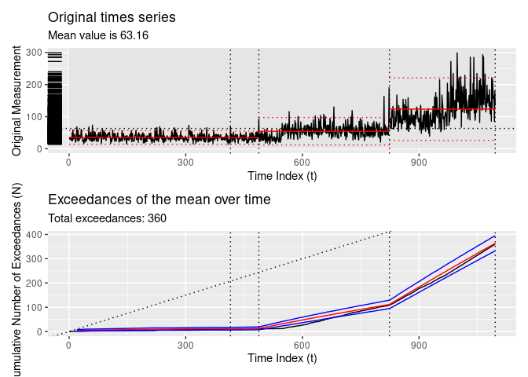
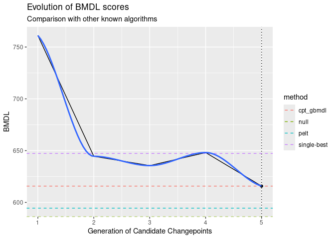

# tidychangepoint

<!-- badges: start -->
[](https://github.com/beanumber/tidychangepoint/actions/workflows/R-CMD-check.yaml)
<!-- badges: end -->

## Usage

``` r
remotes::install_github("beanumber/tidychangepoint")
```

``` r
library(tidychangepoint)
```

## Tidy methods for changepoint analysis

Consider the following time series:

``` r
plot(as.ts(DataCPSim))
```

<!-- -->

`tidychangepoint` allows you to use any number of algorithms for
detecting changepoints in univariate time series with a common,
`tidyverse`-compliant interface. The `segment()` function takes a
numeric vector that is coercible into a `ts` object, and a string
indicating the algorithm you wish you use. `segment()` always returns a
`tidycpt` object.

``` r
cpts <- segment(DataCPSim, method = "pelt")
```

    ## method: pelt

``` r
class(cpts)
```

    ## [1] "tidycpt"

Various methods are available for `tidycpt` objects. For example,
`as.ts()` returns the original data as `ts` object, and `changepoints()`
returns the set of changepoints.

``` r
changepoints(cpts)
```

    ## [1] 547 822 972

### `broom` Interface

`tidychangepoint` follows the design interface of the `broom` package.
Therefore, `augment()`, `tidy()` and `glance()` methods exists for
`tidycpt` objects.

- `augment()` returns a `tsibble` that is grouped according to the
  regions defined by the changepoints.

``` r
augment(cpts)
```

    ## # A tsibble: 1,096 x 3 [1]
    ## # Groups:    region [4]
    ##    index     y region 
    ##    <int> <dbl> <fct>  
    ##  1     1  35.5 [0,547)
    ##  2     2  29.0 [0,547)
    ##  3     3  35.6 [0,547)
    ##  4     4  33.0 [0,547)
    ##  5     5  29.5 [0,547)
    ##  6     6  25.4 [0,547)
    ##  7     7  28.8 [0,547)
    ##  8     8  50.3 [0,547)
    ##  9     9  24.9 [0,547)
    ## 10    10  58.9 [0,547)
    ## # ℹ 1,086 more rows

- `tidy()` returns a `tbl` that provides summary statistics for each
  region

``` r
tidy(cpts)
```

    ## # A tibble: 4 × 13
    ##   region   num_obs   min   max  mean    sd exceedances begin   end log_posterior
    ##   <chr>      <int> <dbl> <dbl> <dbl> <dbl> <named lis> <dbl> <dbl>         <dbl>
    ## 1 [0,547)      546  13.7  92.8  35.3  11.3 <int [11]>      0   547         -60.1
    ## 2 [547,82…     275  20.5 163.   58.1  19.3 <int [95]>    547   822        -198. 
    ## 3 [822,97…     150  39.2 215.   96.7  30.5 <int [129]>   822   972        -150. 
    ## 4 [972,1.…     125  67.2 299.  156.   49.6 <int [125]>   972  1096        -126. 
    ## # ℹ 3 more variables: logLik <dbl>, alpha <dbl>, beta <dbl>

- `glance()` returns a `tbl` that provides summary statistics for the
  model fit.

``` r
glance(cpts)
```

    ## # A tibble: 1 × 11
    ##   pkg         version algorithm params       num_cpts elapsed_time   nhpp_logLik
    ##   <chr>       <chr>   <chr>     <list>          <int> <drtn>         <logLik>   
    ## 1 changepoint 2.2.4   PELT      <named list>        3 0.1093771 secs -525.8797  
    ## # ℹ 4 more variables: nhpp_AIC <dbl>, nhpp_BIC <dbl>, nhpp_MBIC <dbl>,
    ## #   nhpp_BMDL <dbl>

### Other methods

The `plot()` method leverages `ggplot2` to provide an informative plot.

``` r
plot(cpts)
```

<!-- -->

The `diagnose()` function shows the empirical cumulative distribution of
the exceedances of the time series, as well as how that distribution is
modeled as a non-homogeneous Poisson process.

``` r
diagnose(cpts)
```

    ## Warning: Removed 2 rows containing missing values or values outside the scale range
    ## (`geom_line()`).
    ## Removed 2 rows containing missing values or values outside the scale range
    ## (`geom_line()`).
    ## Removed 2 rows containing missing values or values outside the scale range
    ## (`geom_line()`).

<!-- -->

## Algorithms

### From `changepoint`

The `segment()` function passes argument to the `cpt.meanvar()` function
from the `changepoint` package, and stores the resulting `cpt` object as
its `segmenter` object.

``` r
x <- changepoint::cpt.meanvar(DataCPSim, method = "PELT")
identical(x, cpts$segmenter)
```

    ## [1] TRUE

### Naive methods

`segment()` includes three options for computing changepoints using
naive methods, all of which return `lm` objects:

- `method = "null"`: returns null model with no changepoints

``` r
DataCPSim |>
  segment(method = "null") |>
  diagnose()
```

    ## method: null

    ## Warning: Removed 2 rows containing missing values or values outside the scale range
    ## (`geom_line()`).
    ## Removed 2 rows containing missing values or values outside the scale range
    ## (`geom_line()`).
    ## Removed 2 rows containing missing values or values outside the scale range
    ## (`geom_line()`).

<!-- -->

- `method = "manual"`: returns a model with changepoints specified
  manually using the `cpts` argument

``` r
DataCPSim |>
  segment(method = "manual", cpts = c(365, 826)) |>
  diagnose()
```

    ## method: manual

    ## Warning: Removed 2 rows containing missing values or values outside the scale range
    ## (`geom_line()`).
    ## Removed 2 rows containing missing values or values outside the scale range
    ## (`geom_line()`).
    ## Removed 2 rows containing missing values or values outside the scale range
    ## (`geom_line()`).

<!-- -->

- `method = "single-best"`: returns the model with at most one
  changepoint that minimizes the log-likelihood

``` r
DataCPSim |>
  segment(method = "single-best") |>
  diagnose()
```

    ## method: single-best

    ## Warning: Removed 2 rows containing missing values or values outside the scale range
    ## (`geom_line()`).
    ## Removed 2 rows containing missing values or values outside the scale range
    ## (`geom_line()`).
    ## Removed 2 rows containing missing values or values outside the scale range
    ## (`geom_line()`).

<!-- -->

- `method = "random"`: returns the best model from a random collection

``` r
DataCPSim |>
  segment(method = "random", num_generations = 20) |>
  diagnose()
```

    ## method: random

    ## Warning: Removed 2 rows containing missing values or values outside the scale range
    ## (`geom_line()`).
    ## Removed 2 rows containing missing values or values outside the scale range
    ## (`geom_line()`).
    ## Removed 2 rows containing missing values or values outside the scale range
    ## (`geom_line()`).

<!-- -->

### Genetic BMDL

- `method = "gbmdl"`: implements the Genetic BMDL heuristic

``` r
x <- DataCPSim |>
  segment(method = "gbmdl", num_generations = 5)
```

    ## method: gbmdl

    ##   |                                                                    |                                                            |   0%  |                                                                    |===============                                             |  25%  |                                                                    |==============================                              |  50%  |                                                                    |=============================================               |  75%  |                                                                    |============================================================| 100%

``` r
changepoints(x)
```

    ## [1] 562 649 864

``` r
diagnose(x)
```

    ## Warning: Removed 2 rows containing missing values or values outside the scale range
    ## (`geom_line()`).
    ## Removed 2 rows containing missing values or values outside the scale range
    ## (`geom_line()`).
    ## Removed 2 rows containing missing values or values outside the scale range
    ## (`geom_line()`).

<!-- -->

Diagnostic plots are also available.

``` r
plot(x$segmenter)
```

    ## method: null

    ## method: single-best

    ## method: pelt

    ## `geom_smooth()` using method = 'loess' and formula = 'y ~ x'

    ## Warning in simpleLoess(y, x, w, span, degree = degree, parametric = parametric,
    ## : span too small.  fewer data values than degrees of freedom.

    ## Warning in simpleLoess(y, x, w, span, degree = degree, parametric = parametric,
    ## : pseudoinverse used at 0.98

    ## Warning in simpleLoess(y, x, w, span, degree = degree, parametric = parametric,
    ## : neighborhood radius 2.02

    ## Warning in simpleLoess(y, x, w, span, degree = degree, parametric = parametric,
    ## : reciprocal condition number 0

    ## Warning in simpleLoess(y, x, w, span, degree = degree, parametric = parametric,
    ## : There are other near singularities as well. 4.0804

<!-- -->

``` r
diagnose(x$segmenter)
```

    ## `stat_bin()` using `bins = 30`. Pick better value with `binwidth`.

    ## Warning: Removed 2 rows containing missing values or values outside the scale range
    ## (`geom_bar()`).

<!-- -->

## Citation

``` r
citation("tidychangepoint")
```

    ## To cite package 'tidychangepoint' in publications use:
    ## 
    ##   Taimal CA, Suárez-Sierra BM, Rivera JC (2023). "An Exploration of
    ##   Genetic Algorithms Operators for the Detection of Multiple
    ##   Change-Points of Exceedances Using Non-homogeneous Poisson Processes
    ##   and Bayesian Methods." In _Colombian Conference on Computing_,
    ##   230-258. Springer. doi:10.1007/978-3-031-47372-2_20
    ##   <https://doi.org/10.1007/978-3-031-47372-2_20>.
    ## 
    ## A BibTeX entry for LaTeX users is
    ## 
    ##   @InProceedings{,
    ##     title = {An Exploration of Genetic Algorithms Operators for the Detection of Multiple Change-Points of Exceedances Using Non-homogeneous Poisson Processes and Bayesian Methods},
    ##     author = {Carlos A Taimal and Biviana Marcela Suárez-Sierra and Juan Carlos Rivera},
    ##     booktitle = {Colombian Conference on Computing},
    ##     year = {2023},
    ##     pages = {230--258},
    ##     organization = {Springer},
    ##     doi = {10.1007/978-3-031-47372-2_20},
    ##   }
