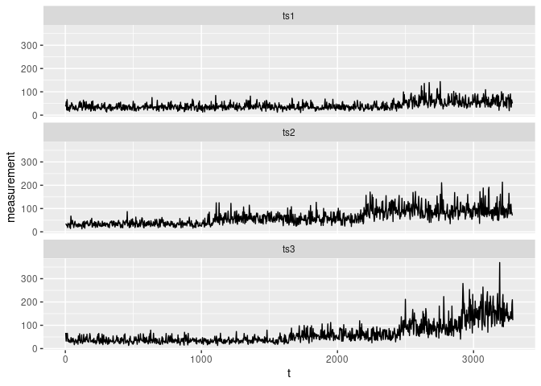

# BayesianMDLGA

<!-- badges: start -->
[](https://github.com/c-taimal/BayesianMDLGA/actions/workflows/R-CMD-check.yaml)
<!-- badges: end -->

## Usage

``` r
remotes::install_github("c-taimal/BayesianMDLGA")
```

``` r
library(BayesianMDLGA)
```

``` r
str(sims)
```

    ## Classes 'tbl_df', 'tbl' and 'data.frame':    1096 obs. of  3 variables:
    ##  $ ts1: num  42.6 39.1 57.5 22.2 66.3 ...
    ##  $ ts2: num  34.6 32.8 31.6 26.5 29.9 ...
    ##  $ ts3: num  67.4 32.2 64.8 44.6 65.4 ...

``` r
str(param)
```

    ## List of 33
    ##  $ nombre_datos           : chr "DataCPSimRebases"
    ##  $ frecuencia_datos       : num 7
    ##  $ n_datos                : chr "TODOS"
    ##  $ diarios0_rebases1      : num 0
    ##  $ valor_de_rebase        : num 63.2
    ##  $ r                      : num 50
    ##  $ k                      : num 50
    ##  $ penalty                : chr "BMDL"
    ##  $ max_num_cp             : num 20
    ##  $ prob_inicial           : num 0.06
    ##  $ prob_volado            : num 0.5
    ##  $ probs_muta             : num [1:3] 0.3 0.4 0.3
    ##  $ mutaciones             : num [1:3] -1 0 1
    ##  $ dist_extremos          : num 10
    ##  $ prob_para_sin_cp       : num 0.5
    ##  $ cp_real                : chr "sin cp_real"
    ##  $ quita_ini0_fin1        : num 0
    ##  $ probs_rank0_MDL1       : num 0
    ##  $ nombre_carpeta_pdf     : chr "Figures"
    ##  $ nombre_carpeta_RData   : chr "Data"
    ##  $ cuantos_mejores_cp_graf: num 100
    ##  $ my_data                : NULL
    ##  $ minimo_numero_de_cp    : num 1
    ##  $ probs_nuevos_muta0N    : num [1:3] 0.8 0.1 0.1
    ##  $ rf_type                : chr "W"
    ##  $ initial_val_optim      : num [1:2] 0.1 0.5
    ##  $ mat_low_upp            : num [1:2, 1:2] 1e-04 1e-08 1e+01 1e+05
    ##  $ vec_dist_a_priori      : chr [1:2] "Gamma" "Gamma"
    ##  $ mat_phi                : num [1:2, 1:2] 1 3 2 1.2
    ##  $ ajuste_bloque          : logi TRUE
    ##  $ print_progress_bar     : logi TRUE
    ##  $ print_progress_plots   : logi TRUE
    ##  $ value_set_seed         : num 123

``` r
str(pm_25)
```

    ## Classes 'spec_tbl_df', 'tbl_df', 'tbl' and 'data.frame': 1096 obs. of  1 variable:
    ##  $ PM2.5: num  393 277 303 336 329 201 237 235 292 276 ...
    ##  - attr(*, "spec")=List of 3
    ##   ..$ cols   :List of 1
    ##   .. ..$ PM2.5: list()
    ##   .. .. ..- attr(*, "class")= chr [1:2] "collector_number" "collector"
    ##   ..$ default: list()
    ##   .. ..- attr(*, "class")= chr [1:2] "collector_guess" "collector"
    ##   ..$ delim  : chr ","
    ##   ..- attr(*, "class")= chr "col_spec"
    ##  - attr(*, "problems")=<externalptr>

``` r
summary(pm_25)
```

    ##      PM2.5      
    ##  Min.   : 13.0  
    ##  1st Qu.:207.0  
    ##  Median :300.0  
    ##  Mean   :288.3  
    ##  3rd Qu.:377.0  
    ##  Max.   :785.0

``` r
library(tidyverse)
sims |>
  pivot_longer(
    cols = everything(), 
    names_to = "set", 
    values_to = "measurement"
  ) |>
  mutate(t = row_number()) |>
  ggplot(aes(x = t, y = measurement)) +
  geom_line() +
  facet_wrap(vars(set), ncol = 1)
```

<!-- -->

``` r
AG_BMDL_r_paso(DataCPSimRebases, param)
```

    ##   |                                                                    |                                                            |   0%

<!-- -->

    ##   |                                                                    |=                                                           |   2%

<!-- -->

    ##   |                                                                    |==                                                          |   4%

<!-- -->

    ##   |                                                                    |====                                                        |   6%

<!-- -->

    ##   |                                                                    |=====                                                       |   8%

<!-- -->

    ##   |                                                                    |======                                                      |  10%

<!-- -->

    ##   |                                                                    |=======                                                     |  12%

<!-- -->

    ##   |                                                                    |=========                                                   |  14%

<!-- -->

    ##   |                                                                    |==========                                                  |  16%

<!-- -->

    ##   |                                                                    |===========                                                 |  18%

<!-- -->

    ##   |                                                                    |============                                                |  20%

<!-- -->

    ##   |                                                                    |=============                                               |  22%

<!-- -->

    ##   |                                                                    |===============                                             |  24%

<!-- -->

    ##   |                                                                    |================                                            |  27%

<!-- -->

    ##   |                                                                    |=================                                           |  29%

<!-- -->

    ##   |                                                                    |==================                                          |  31%

<!-- -->

    ##   |                                                                    |====================                                        |  33%

<!-- -->

    ##   |                                                                    |=====================                                       |  35%

<!-- -->

    ##   |                                                                    |======================                                      |  37%

<!-- -->

    ##   |                                                                    |=======================                                     |  39%

<!-- -->

    ##   |                                                                    |========================                                    |  41%

<!-- -->

    ##   |                                                                    |==========================                                  |  43%

<!-- -->

    ##   |                                                                    |===========================                                 |  45%

<!-- -->

    ##   |                                                                    |============================                                |  47%

<!-- -->

    ##   |                                                                    |=============================                               |  49%

<!-- -->

    ##   |                                                                    |===============================                             |  51%

<!-- -->

    ##   |                                                                    |================================                            |  53%

<!-- -->

    ##   |                                                                    |=================================                           |  55%

<!-- -->

    ##   |                                                                    |==================================                          |  57%

<!-- -->

    ##   |                                                                    |====================================                        |  59%

<!-- -->

    ##   |                                                                    |=====================================                       |  61%

<!-- -->

    ##   |                                                                    |======================================                      |  63%

<!-- -->

    ##   |                                                                    |=======================================                     |  65%

<!-- -->

    ##   |                                                                    |========================================                    |  67%

<!-- -->

    ##   |                                                                    |==========================================                  |  69%

<!-- -->

    ##   |                                                                    |===========================================                 |  71%

<!-- -->

    ##   |                                                                    |============================================                |  73%

<!-- -->

    ##   |                                                                    |=============================================               |  76%

<!-- -->

    ##   |                                                                    |===============================================             |  78%

<!-- -->

    ##   |                                                                    |================================================            |  80%

<!-- -->

    ##   |                                                                    |=================================================           |  82%

<!-- -->

    ##   |                                                                    |==================================================          |  84%

<!-- -->

    ##   |                                                                    |===================================================         |  86%

<!-- -->

    ##   |                                                                    |=====================================================       |  88%

<!-- -->

    ##   |                                                                    |======================================================      |  90%

<!-- -->

    ##   |                                                                    |=======================================================     |  92%

<!-- -->

    ##   |                                                                    |========================================================    |  94%

<!-- -->

    ##   |                                                                    |==========================================================  |  96%

<!-- -->

    ##   |                                                                    |=========================================================== |  98%

<!-- -->

    ##   |                                                                    |============================================================| 100%

<!-- -->

    ## Se guardo la imagen:
    ## /tmp/RtmpK6V0do/Figures/Fig_CP_repetidos_DataCPSimRebases_rf_W_Gamma(1,2)_Gamma(3,1.2)_r50_k50_BMDL_586.pdf

<!-- -->

    ## Se guardo la imagen:
    ## /tmp/RtmpK6V0do/Figures/Fig_4AGBMDL_DataCPSimRebases_rf_W_Gamma(1,2)_Gamma(3,1.2)_r50_k50_BMDL_586.pdf

    ## Se guardo el archivo:
    ## /tmp/RtmpK6V0do/Data/Dat_AGBMDL_DataCPSimRebases_rf_W_Gamma(1,2)_Gamma(3,1.2)_r50_k50_BMDL_586.RData

<!-- -->

    ## $x
    ##   [1]   20   51   60  221  226  233  271  308  354  415  488  548  553  556  557
    ##  [16]  561  562  566  571  575  581  583  589  590  596  598  604  605  609  613
    ##  [31]  614  615  618  619  621  623  628  629  633  634  642  645  646  647  649
    ##  [46]  654  655  656  657  659  663  666  668  671  672  677  678  680  681  687
    ##  [61]  688  694  697  698  704  705  706  708  711  713  716  717  719  722  725
    ##  [76]  727  728  729  733  738  741  746  748  749  753  755  761  763  765  768
    ##  [91]  771  774  777  780  784  785  790  791  792  794  798  803  809  810  813
    ## [106]  817  822  823  824  825  826  828  830  831  832  833  834  836  837  838
    ## [121]  839  840  841  842  843  844  845  846  848  849  850  851  852  853  854
    ## [136]  856  857  858  859  860  861  862  863  864  865  866  867  868  870  871
    ## [151]  872  875  876  877  878  879  880  881  882  883  884  885  886  887  888
    ## [166]  889  890  891  892  893  894  895  896  897  898  899  900  901  903  904
    ## [181]  905  907  908  910  911  912  914  915  916  918  919  920  921  923  924
    ## [196]  926  928  929  930  931  932  933  934  935  936  937  938  939  940  941
    ## [211]  943  944  945  946  947  948  949  950  951  953  954  955  957  959  960
    ## [226]  961  962  963  964  966  967  968  969  970  971  972  973  974  975  976
    ## [241]  977  978  979  980  981  982  983  984  985  986  987  988  989  990  991
    ## [256]  992  993  994  995  996  997  998  999 1000 1001 1002 1003 1004 1005 1006
    ## [271] 1007 1008 1009 1010 1011 1012 1013 1014 1015 1016 1017 1018 1019 1020 1021
    ## [286] 1022 1023 1024 1025 1026 1027 1028 1029 1030 1031 1032 1033 1034 1035 1036
    ## [301] 1037 1038 1039 1040 1041 1042 1043 1044 1045 1046 1047 1048 1049 1050 1051
    ## [316] 1052 1053 1054 1055 1056 1057 1058 1059 1060 1061 1062 1063 1064 1065 1066
    ## [331] 1067 1068 1069 1070 1071 1072 1073 1074 1075 1076 1077 1078 1079 1080 1081
    ## [346] 1082 1083 1084 1085 1086 1087 1088 1089 1090 1091 1092 1093 1094 1095 1096
    ## 
    ## $historia_mejores
    ##       [,1] [,2] [,3] [,4] [,5] [,6] [,7] [,8] [,9] [,10] [,11] [,12] [,13]
    ##  [1,]   11    1  556  566  837  862  911  962  966   972  1062  1071  1085
    ##  [2,]    7    1  598  654  728  763  978  980 1065  1096     0     0     0
    ##  [3,]    8    1  556  581  722  784  884  901  955  1003  1096     0     0
    ##  [4,]    4    1  753  765  846  985 1096    0    0     0     0     0     0
    ##  [5,]    7    1  589  633  830  974  981  995 1001  1096     0     0     0
    ##  [6,]    5    1  589  708  851  885  967 1096    0     0     0     0     0
    ##  [7,]    8    1  548  571  589  729  899  955  970  1068  1096     0     0
    ##  [8,]    4    1  598  666  706  944 1096    0    0     0     0     0     0
    ##  [9,]    4    1  583  833  963  964 1096    0    0     0     0     0     0
    ## [10,]    4    1  553  557  871  998 1096    0    0     0     0     0     0
    ## [11,]    4    1  716  896  919  961 1096    0    0     0     0     0     0
    ## [12,]    7    1  561  589  698  777  828  860 1082  1096     0     0     0
    ## [13,]    4    1  488  711 1028 1030 1096    0    0     0     0     0     0
    ## [14,]    2    1  561  706 1096    0    0    0    0     0     0     0     0
    ## [15,]    3    1  561  583  845 1096    0    0    0     0     0     0     0
    ## [16,]    3    1  557  708  719 1096    0    0    0     0     0     0     0
    ## [17,]    5    1  561  583  590  844 1083 1096    0     0     0     0     0
    ## [18,]    2    1  561  589 1096    0    0    0    0     0     0     0     0
    ## [19,]    2    1  561  984 1096    0    0    0    0     0     0     0     0
    ## [20,]    4    1  557  583  966 1082 1096    0    0     0     0     0     0
    ## [21,]    5    1  557  561  844  962  983 1096    0     0     0     0     0
    ## [22,]    5    1  553  561  571  843  963 1096    0     0     0     0     0
    ## [23,]    2    1  845  846 1096    0    0    0    0     0     0     0     0
    ## [24,]    3    1  867  961  964 1096    0    0    0     0     0     0     0
    ## [25,]    3    1  548  589  590 1096    0    0    0     0     0     0     0
    ## [26,]    5    1  553  845  850  861 1081 1096    0     0     0     0     0
    ## [27,]    2    1  596  935 1096    0    0    0    0     0     0     0     0
    ## [28,]    5    1  556  561  619  838  945 1096    0     0     0     0     0
    ## [29,]    2    1  838  876 1096    0    0    0    0     0     0     0     0
    ## [30,]    5    1  548  598  851 1065 1068 1096    0     0     0     0     0
    ## [31,]    2    1  561  614 1096    0    0    0    0     0     0     0     0
    ## [32,]    3    1  557  609  849 1096    0    0    0     0     0     0     0
    ## [33,]   17    1   60  605  628  654  680  763  774   798   856   924   932
    ## [34,]    4    1  557  765 1067 1070 1096    0    0     0     0     0     0
    ## [35,]   17    1  614  619  645  719  729  809  846   865   890   893   905
    ## [36,]    2    1  596  838 1096    0    0    0    0     0     0     0     0
    ## [37,]    2    1  614  886 1096    0    0    0    0     0     0     0     0
    ## [38,]    5    1  557  566  609  854 1057 1096    0     0     0     0     0
    ## [39,]    5    1  553  613  828  848 1038 1096    0     0     0     0     0
    ## [40,]    2    1  698  850 1096    0    0    0    0     0     0     0     0
    ## [41,]    5    1  583  613  842  944 1047 1096    0     0     0     0     0
    ## [42,]    7    1  557  598  615  705  846  851 1031  1096     0     0     0
    ## [43,]   17    1  548  596  628  749  837  838  843   854   856   901   943
    ## [44,]    3    1  415  615  853 1096    0    0    0     0     0     0     0
    ## [45,]    5    1  415  711  725  842  853 1096    0     0     0     0     0
    ## [46,]    4    1  566  571  843  851 1096    0    0     0     0     0     0
    ## [47,]    7    1  415  566  598  784  842  853  992  1096     0     0     0
    ## [48,]    6    1  553  561  768  894  926  943 1096     0     0     0     0
    ## [49,]    4    1  575  581  856  929 1096    0    0     0     0     0     0
    ## [50,]    2    1  571  852 1096    0    0    0    0     0     0     0     0
    ##       [,14] [,15] [,16] [,17] [,18] [,19] [,20]
    ##  [1,]  1096     0     0     0     0     0     0
    ##  [2,]     0     0     0     0     0     0     0
    ##  [3,]     0     0     0     0     0     0     0
    ##  [4,]     0     0     0     0     0     0     0
    ##  [5,]     0     0     0     0     0     0     0
    ##  [6,]     0     0     0     0     0     0     0
    ##  [7,]     0     0     0     0     0     0     0
    ##  [8,]     0     0     0     0     0     0     0
    ##  [9,]     0     0     0     0     0     0     0
    ## [10,]     0     0     0     0     0     0     0
    ## [11,]     0     0     0     0     0     0     0
    ## [12,]     0     0     0     0     0     0     0
    ## [13,]     0     0     0     0     0     0     0
    ## [14,]     0     0     0     0     0     0     0
    ## [15,]     0     0     0     0     0     0     0
    ## [16,]     0     0     0     0     0     0     0
    ## [17,]     0     0     0     0     0     0     0
    ## [18,]     0     0     0     0     0     0     0
    ## [19,]     0     0     0     0     0     0     0
    ## [20,]     0     0     0     0     0     0     0
    ## [21,]     0     0     0     0     0     0     0
    ## [22,]     0     0     0     0     0     0     0
    ## [23,]     0     0     0     0     0     0     0
    ## [24,]     0     0     0     0     0     0     0
    ## [25,]     0     0     0     0     0     0     0
    ## [26,]     0     0     0     0     0     0     0
    ## [27,]     0     0     0     0     0     0     0
    ## [28,]     0     0     0     0     0     0     0
    ## [29,]     0     0     0     0     0     0     0
    ## [30,]     0     0     0     0     0     0     0
    ## [31,]     0     0     0     0     0     0     0
    ## [32,]     0     0     0     0     0     0     0
    ## [33,]   934   957   974  1007  1043  1057  1096
    ## [34,]     0     0     0     0     0     0     0
    ## [35,]   923   963   989   995  1001  1069  1096
    ## [36,]     0     0     0     0     0     0     0
    ## [37,]     0     0     0     0     0     0     0
    ## [38,]     0     0     0     0     0     0     0
    ## [39,]     0     0     0     0     0     0     0
    ## [40,]     0     0     0     0     0     0     0
    ## [41,]     0     0     0     0     0     0     0
    ## [42,]     0     0     0     0     0     0     0
    ## [43,]   951   977  1022  1032  1040  1087  1096
    ## [44,]     0     0     0     0     0     0     0
    ## [45,]     0     0     0     0     0     0     0
    ## [46,]     0     0     0     0     0     0     0
    ## [47,]     0     0     0     0     0     0     0
    ## [48,]     0     0     0     0     0     0     0
    ## [49,]     0     0     0     0     0     0     0
    ## [50,]     0     0     0     0     0     0     0
    ## 
    ## $lista_AG_BMDL
    ## $lista_AG_BMDL$mat_cp
    ##       [,1] [,2] [,3] [,4] [,5] [,6] [,7] [,8] [,9] [,10] [,11] [,12] [,13]
    ##  [1,]    3    1  583  846  943 1096    0    0    0     0     0     0     0
    ##  [2,]    5    1  557  571  792  830  842 1096    0     0     0     0     0
    ##  [3,]    4    1  575  598  851  854 1096    0    0     0     0     0     0
    ##  [4,]    5    1  556  561  571  711  725 1096    0     0     0     0     0
    ##  [5,]    6    1  488  566  604  839  854  863 1096     0     0     0     0
    ##  [6,]    5    1  581  843  894  943 1000 1096    0     0     0     0     0
    ##  [7,]    6    1  646  846  848  862  935 1055 1096     0     0     0     0
    ##  [8,]    5    1  604  841  842  852  860 1096    0     0     0     0     0
    ##  [9,]    3    1  571  596  838 1096    0    0    0     0     0     0     0
    ## [10,]    3    1  561  598  843 1096    0    0    0     0     0     0     0
    ## [11,]    5    1  556  842  844  849 1063 1096    0     0     0     0     0
    ## [12,]    3    1  561  618  830 1096    0    0    0     0     0     0     0
    ## [13,]    5    1  566  621  840  852 1046 1096    0     0     0     0     0
    ## [14,]    2    1  488  843 1096    0    0    0    0     0     0     0     0
    ## [15,]    4    1  843  851  972 1016 1096    0    0     0     0     0     0
    ## [16,]    2    1  566  609 1096    0    0    0    0     0     0     0     0
    ## [17,]   17    1  598  659  672  706  792  826  856   859   931   961   963
    ## [18,]    9    1  556  557  598  706  826  839  848   853   856  1096     0
    ## [19,]    3    1  575  583  849 1096    0    0    0     0     0     0     0
    ## [20,]    4    1  556  575  853  944 1096    0    0     0     0     0     0
    ## [21,]    4    1  415  581  854  957 1096    0    0     0     0     0     0
    ## [22,]    6    1  556  716  719  842  879  893 1096     0     0     0     0
    ## [23,]    4    1  609  765  843  856 1096    0    0     0     0     0     0
    ## [24,]    5    1  488  562  791  828  852 1096    0     0     0     0     0
    ## [25,]    3    1  553  848  935 1096    0    0    0     0     0     0     0
    ## [26,]    4    1  553  841  856  941 1096    0    0     0     0     0     0
    ## [27,]    4    1  598  706  853  854 1096    0    0     0     0     0     0
    ## [28,]    7    1  561  831  854  930  935  964  968  1096     0     0     0
    ## [29,]    6    1  553  556  604  706  725  839 1096     0     0     0     0
    ## [30,]    2    1  571  852 1096    0    0    0    0     0     0     0     0
    ## [31,]   17    1  566  629  694  828  853  866  879   893   897   912   933
    ## [32,]    2    1  566  848 1096    0    0    0    0     0     0     0     0
    ## [33,]    4    1  583  609  647  765 1096    0    0     0     0     0     0
    ## [34,]    3    1  791  830  840 1096    0    0    0     0     0     0     0
    ## [35,]    6    1  571  623  841  860  870 1005 1096     0     0     0     0
    ## [36,]    3    1  415  561  852 1096    0    0    0     0     0     0     0
    ## [37,]    4    1  566  609  761  841 1096    0    0     0     0     0     0
    ## [38,]    2    1  845  879 1096    0    0    0    0     0     0     0     0
    ## [39,]    5    1  830  841  943 1001 1013 1096    0     0     0     0     0
    ## [40,]    4    1  553  561  848  878 1096    0    0     0     0     0     0
    ## [41,]    5    1  415  566  583  828  862 1096    0     0     0     0     0
    ## [42,]   17    1   51  598  619  649  655  846  852   891   895   904   918
    ## [43,]    5    1  553  566  581  843  863 1096    0     0     0     0     0
    ## [44,]    3    1  618  831  862 1096    0    0    0     0     0     0     0
    ## [45,]    4    1  634  840  841  862 1096    0    0     0     0     0     0
    ## [46,]    5    1  605  628  763  841  844 1096    0     0     0     0     0
    ## [47,]    4    1  575  581  844  944 1096    0    0     0     0     0     0
    ## [48,]    4    1  553  590  609  844 1096    0    0     0     0     0     0
    ## [49,]    4    1  704  842  843  849 1096    0    0     0     0     0     0
    ## [50,]    3    1  561  850  945 1096    0    0    0     0     0     0     0
    ##       [,14] [,15] [,16] [,17] [,18] [,19] [,20]
    ##  [1,]     0     0     0     0     0     0     0
    ##  [2,]     0     0     0     0     0     0     0
    ##  [3,]     0     0     0     0     0     0     0
    ##  [4,]     0     0     0     0     0     0     0
    ##  [5,]     0     0     0     0     0     0     0
    ##  [6,]     0     0     0     0     0     0     0
    ##  [7,]     0     0     0     0     0     0     0
    ##  [8,]     0     0     0     0     0     0     0
    ##  [9,]     0     0     0     0     0     0     0
    ## [10,]     0     0     0     0     0     0     0
    ## [11,]     0     0     0     0     0     0     0
    ## [12,]     0     0     0     0     0     0     0
    ## [13,]     0     0     0     0     0     0     0
    ## [14,]     0     0     0     0     0     0     0
    ## [15,]     0     0     0     0     0     0     0
    ## [16,]     0     0     0     0     0     0     0
    ## [17,]   984   990  1001  1037  1067  1089  1096
    ## [18,]     0     0     0     0     0     0     0
    ## [19,]     0     0     0     0     0     0     0
    ## [20,]     0     0     0     0     0     0     0
    ## [21,]     0     0     0     0     0     0     0
    ## [22,]     0     0     0     0     0     0     0
    ## [23,]     0     0     0     0     0     0     0
    ## [24,]     0     0     0     0     0     0     0
    ## [25,]     0     0     0     0     0     0     0
    ## [26,]     0     0     0     0     0     0     0
    ## [27,]     0     0     0     0     0     0     0
    ## [28,]     0     0     0     0     0     0     0
    ## [29,]     0     0     0     0     0     0     0
    ## [30,]     0     0     0     0     0     0     0
    ## [31,]   967   979  1022  1081  1087  1088  1096
    ## [32,]     0     0     0     0     0     0     0
    ## [33,]     0     0     0     0     0     0     0
    ## [34,]     0     0     0     0     0     0     0
    ## [35,]     0     0     0     0     0     0     0
    ## [36,]     0     0     0     0     0     0     0
    ## [37,]     0     0     0     0     0     0     0
    ## [38,]     0     0     0     0     0     0     0
    ## [39,]     0     0     0     0     0     0     0
    ## [40,]     0     0     0     0     0     0     0
    ## [41,]     0     0     0     0     0     0     0
    ## [42,]   979  1005  1019  1070  1080  1092  1096
    ## [43,]     0     0     0     0     0     0     0
    ## [44,]     0     0     0     0     0     0     0
    ## [45,]     0     0     0     0     0     0     0
    ## [46,]     0     0     0     0     0     0     0
    ## [47,]     0     0     0     0     0     0     0
    ## [48,]     0     0     0     0     0     0     0
    ## [49,]     0     0     0     0     0     0     0
    ## [50,]     0     0     0     0     0     0     0
    ## 
    ## $lista_AG_BMDL$vec_BMDL_k_cp
    ##  [1] 620.7221 682.3464 612.7140 734.1199 640.2629 654.7069 629.8685 686.4068
    ##  [9] 670.7910 650.0290 638.1831 652.8310 606.0128 686.7464 687.1560 622.0669
    ## [17] 622.3746 687.9044 682.0507 675.1665 661.1471 624.4801 638.3243 684.0783
    ## [25] 622.4185 630.2067 642.9621 686.4479 672.6062 605.8640 645.4966 711.6074
    ## [33] 676.3595 648.2371 609.2041 642.1418 711.0928 629.4421 610.6716 626.1861
    ## [41] 643.3575 645.2567 732.3095 655.2430 636.4882 622.5239 644.3481 628.5716
    ## [49] 708.6703 667.1138
    ## 
    ## 
    ## $vec_min_BMDL
    ##  [1] 855.8155 658.3966 606.1193 643.7164 614.9734 626.7782 627.0348 614.3733
    ##  [9] 614.0191 612.9008 603.9442 613.3832 613.7734 589.0907 601.7690 593.6566
    ## [17] 599.4772 605.2639 592.9282 604.5720 613.1924 589.3444 605.5718 608.3683
    ## [25] 600.3402 600.0168 605.2639 596.9412 595.2160 603.0176 590.6518 597.1935
    ## [33] 598.9235 601.3915 613.5774 606.1035 606.0250 586.2545 602.8866 586.2545
    ## [41] 590.5735 592.8639 592.8639 607.4513 591.3284 603.0176 600.1979 608.0316
    ## [49] 599.4409 605.8640
    ## 
    ## $valor_BMDL_minimo
    ## [1] "_BMDL_586"
    ## 
    ## $cromosoma_minimo_BMDL
    ##  [1]    5    1  557  566  609  854 1057 1096    0    0    0    0    0    0    0
    ## [16]    0    0    0    0    0
    ## 
    ## $minimo_BMDL
    ## [1] 586.2545
    ## 
    ## $param
    ## $param$nombre_datos
    ## [1] "DataCPSimRebases"
    ## 
    ## $param$frecuencia_datos
    ## [1] 7
    ## 
    ## $param$n_datos
    ## [1] "TODOS"
    ## 
    ## $param$diarios0_rebases1
    ## [1] 0
    ## 
    ## $param$valor_de_rebase
    ## [1] 63.16459
    ## 
    ## $param$r
    ## [1] 50
    ## 
    ## $param$k
    ## [1] 50
    ## 
    ## $param$penalty
    ## [1] "BMDL"
    ## 
    ## $param$max_num_cp
    ## [1] 20
    ## 
    ## $param$prob_inicial
    ## [1] 0.06
    ## 
    ## $param$prob_volado
    ## [1] 0.5
    ## 
    ## $param$probs_muta
    ## [1] 0.3 0.4 0.3
    ## 
    ## $param$mutaciones
    ## [1] -1  0  1
    ## 
    ## $param$dist_extremos
    ## [1] 10
    ## 
    ## $param$prob_para_sin_cp
    ## [1] 0.5
    ## 
    ## $param$cp_real
    ## [1] "sin cp_real"
    ## 
    ## $param$quita_ini0_fin1
    ## [1] 0
    ## 
    ## $param$probs_rank0_MDL1
    ## [1] 0
    ## 
    ## $param$nombre_carpeta_pdf
    ## [1] "Figures"
    ## 
    ## $param$nombre_carpeta_RData
    ## [1] "Data"
    ## 
    ## $param$cuantos_mejores_cp_graf
    ## [1] 100
    ## 
    ## $param$my_data
    ## NULL
    ## 
    ## $param$minimo_numero_de_cp
    ## [1] 1
    ## 
    ## $param$probs_nuevos_muta0N
    ## [1] 0.8 0.1 0.1
    ## 
    ## $param$rf_type
    ## [1] "W"
    ## 
    ## $param$initial_val_optim
    ## [1] 0.1 0.5
    ## 
    ## $param$mat_low_upp
    ##       [,1]  [,2]
    ## [1,] 1e-04 1e+01
    ## [2,] 1e-08 1e+05
    ## 
    ## $param$vec_dist_a_priori
    ## [1] "Gamma" "Gamma"
    ## 
    ## $param$mat_phi
    ##      [,1] [,2]
    ## [1,]    1  2.0
    ## [2,]    3  1.2
    ## 
    ## $param$ajuste_bloque
    ## [1] TRUE
    ## 
    ## $param$print_progress_bar
    ## [1] TRUE
    ## 
    ## $param$print_progress_plots
    ## [1] TRUE
    ## 
    ## $param$value_set_seed
    ## [1] 123

## Citation

``` r
citation("BayesianMDLGA")
```

    ## To cite package 'BayesianMDLGA' in publications use:
    ## 
    ##   Taimal CA, Suárez-Sierra BM, Rivera JC (2023). "An Exploration of
    ##   Genetic Algorithms Operators for the Detection of Multiple
    ##   Change-Points of Exceedances Using Non-homogeneous Poisson Processes
    ##   and Bayesian Methods." In _Colombian Conference on Computing_,
    ##   230-258. Springer. doi:10.1007/978-3-031-47372-2_20
    ##   <https://doi.org/10.1007/978-3-031-47372-2_20>.
    ## 
    ## A BibTeX entry for LaTeX users is
    ## 
    ##   @InProceedings{,
    ##     title = {An Exploration of Genetic Algorithms Operators for the Detection of Multiple Change-Points of Exceedances Using Non-homogeneous Poisson Processes and Bayesian Methods},
    ##     author = {Carlos A Taimal and Biviana Marcela Suárez-Sierra and Juan Carlos Rivera},
    ##     booktitle = {Colombian Conference on Computing},
    ##     year = {2023},
    ##     pages = {230--258},
    ##     organization = {Springer},
    ##     doi = {10.1007/978-3-031-47372-2_20},
    ##   }
