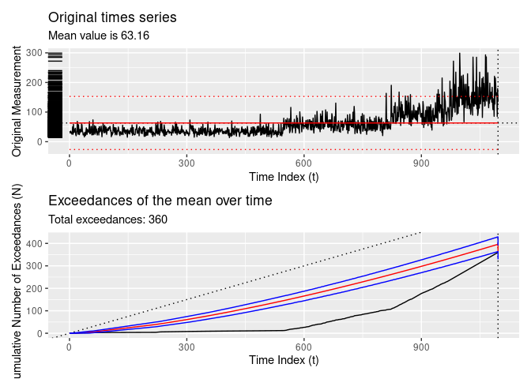
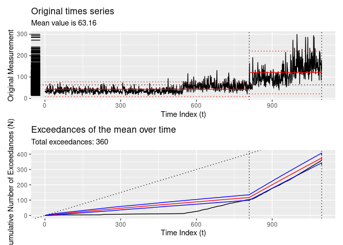
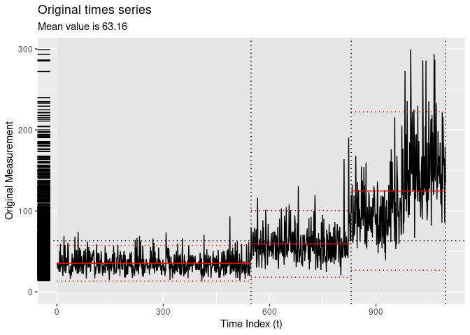
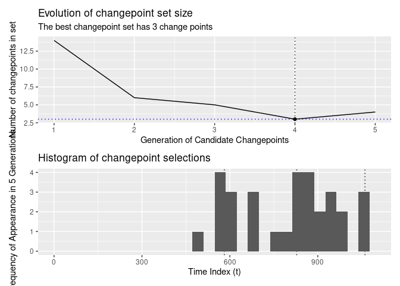

# tidychangepoint

<!-- badges: start -->
[](https://github.com/c-taimal/tidychangepoint/actions/workflows/R-CMD-check.yaml)
<!-- badges: end -->

## Usage

``` r
remotes::install_github("beanumber/tidychangepoint")
```

``` r
library(tidychangepoint)
```

## Tidy methods for changepoint analysis

Consider the following time series:

``` r
plot(as.ts(DataCPSim))
```

<!-- -->

`tidychangepoint` allows you to use any number of algorithms for
detecting changepoints in univariate time series with a common,
`tidyverse`-compliant interface. The `segment()` function takes a
numeric vector that is coercible into a `ts` object, and a string
indicating the algorithm you wish you use. `segment()` always returns a
`tidycpt` object.

``` r
cpts <- segment(DataCPSim, method = "cpt-pelt")
```

    ## method: cpt-pelt

``` r
class(cpts)
```

    ## [1] "tidycpt"

Various methods are available for `tidycpt` objects. For example,
`as.ts()` returns the original data as `ts` object, and `changepoints()`
returns the set of changepoints.

``` r
changepoints(cpts)
```

    ## [1] 547 822 972

### `broom` Interface

`tidychangepoint` follows the design interface of the `broom` package.
Therefore, `augment()`, `tidy()` and `glance()` methods exists for
`tidycpt` objects.

- `augment()` returns a `tsibble` that is grouped according to the
  regions defined by the changepoints.

``` r
augment(cpts)
```

    ## # A tsibble: 1,096 x 3 [1]
    ## # Groups:    region [4]
    ##    index     y region 
    ##    <int> <dbl> <fct>  
    ##  1     1  35.5 [0,547)
    ##  2     2  29.0 [0,547)
    ##  3     3  35.6 [0,547)
    ##  4     4  33.0 [0,547)
    ##  5     5  29.5 [0,547)
    ##  6     6  25.4 [0,547)
    ##  7     7  28.8 [0,547)
    ##  8     8  50.3 [0,547)
    ##  9     9  24.9 [0,547)
    ## 10    10  58.9 [0,547)
    ## # ℹ 1,086 more rows

- `tidy()` returns a `tbl` that provides summary statistics for each
  region

``` r
tidy(cpts)
```

    ## # A tibble: 4 × 8
    ##   region        num_obs  left right   min   max  mean    sd
    ##   <fct>           <int> <int> <int> <dbl> <dbl> <dbl> <dbl>
    ## 1 [0,547)           546     1   546  13.7  92.8  35.3  11.3
    ## 2 [547,822)         275   547   821  20.5 163.   58.1  19.3
    ## 3 [822,972)         150   822   971  39.2 215.   96.7  30.5
    ## 4 [972,1.1e+03]     125   972  1096  67.2 299.  156.   49.6

- `glance()` returns a `tbl` that provides summary statistics for the
  model fit.

``` r
glance(cpts)
```

    ## # A tibble: 1 × 8
    ##   pkg     version algorithm test_stat  MBIC num_cpts num_cpts_max min_seg_length
    ##   <chr>   <chr>   <chr>     <chr>     <dbl>    <int>        <dbl>          <dbl>
    ## 1 change… 2.2.4   PELT      Normal     28.0        4          Inf              2

### Other methods

The `plot()` method leverages `ggplot2` to provide an informative plot.

``` r
plot(cpts)
```

<!-- -->

The `diagnose()` function shows the empirical cumulative distribution of
the exceedances of the time series, as well as how that distribution is
modeled as a non-homogeneous Poisson process.

``` r
diagnose(cpts)
```

<!-- -->

## Algorithms

### From `changepoint`

The `segment()` function passes argument to the `cpt.meanvar()` function
from the `changepoint` package, and stores the resulting `cpt` object as
its `segmenter` object.

``` r
x <- changepoint::cpt.meanvar(DataCPSim, method = "PELT")
identical(x, cpts$segmenter)
```

    ## [1] TRUE

### Naive methods

`segment()` includes three options for computing changepoints using
naive methods, all of which return `lm` objects:

- `method = "null"`: returns null model with no changepoints

``` r
DataCPSim |>
  segment(method = "null") |>
  plot()
```

    ## method: null

<!-- -->

- `method = "cpt-manual"`: returns a model with changepoints specified
  manually using the `cpts` argument

``` r
DataCPSim |>
  segment(method = "cpt-manual", cpts = c(365, 826)) |>
  plot()
```

    ## method: cpt-manual

    ## 
    ## Segmenting using manually input changepoints...

<!-- -->

- `method = "single-best"`: returns the model with at most one
  changepoint that minimizes the log-likelihood

``` r
DataCPSim |>
  segment(method = "single-best") |>
  plot()
```

    ## method: single-best

<!-- -->

### Genetic BMDL

- `method = "cpt-gbmdl"`: implements the Genetic BMDL heuristic

``` r
# DataCPSim |>
#   segment(method = "cpt-gbmdl", param = param)
changepoints(lista_AG)
```

    ## [1]  566  694  862  884  915  920  939 1007

``` r
plot(lista_AG)
```

<!-- -->

Diagnostic plots are also available.

``` r
plot(lista_AG$segmenter)
```

<!-- -->

    ## Se guardo la imagen:
    ## /tmp/RtmpdjUMrf/Fig_4AGBMDL__rf_W_Gamma(1,2)_Gamma(3,1.2)_r50_k50_BMDL_585.pdf

<!-- -->

## Citation

``` r
citation("tidychangepoint")
```

    ## To cite package 'tidychangepoint' in publications use:
    ## 
    ##   Taimal CA, Suárez-Sierra BM, Rivera JC (2023). "An Exploration of
    ##   Genetic Algorithms Operators for the Detection of Multiple
    ##   Change-Points of Exceedances Using Non-homogeneous Poisson Processes
    ##   and Bayesian Methods." In _Colombian Conference on Computing_,
    ##   230-258. Springer. doi:10.1007/978-3-031-47372-2_20
    ##   <https://doi.org/10.1007/978-3-031-47372-2_20>.
    ## 
    ## A BibTeX entry for LaTeX users is
    ## 
    ##   @InProceedings{,
    ##     title = {An Exploration of Genetic Algorithms Operators for the Detection of Multiple Change-Points of Exceedances Using Non-homogeneous Poisson Processes and Bayesian Methods},
    ##     author = {Carlos A Taimal and Biviana Marcela Suárez-Sierra and Juan Carlos Rivera},
    ##     booktitle = {Colombian Conference on Computing},
    ##     year = {2023},
    ##     pages = {230--258},
    ##     organization = {Springer},
    ##     doi = {10.1007/978-3-031-47372-2_20},
    ##   }
