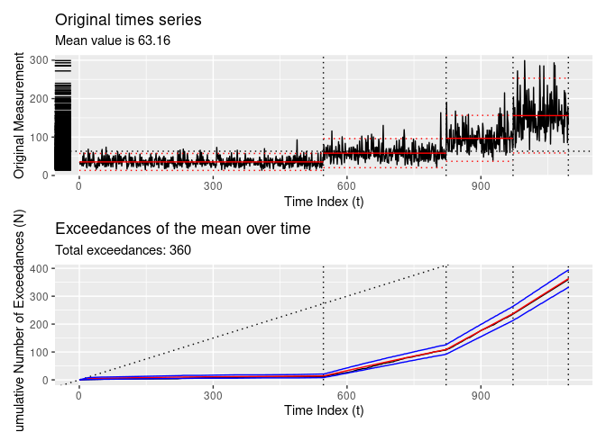

# tidychangepoint

<!-- badges: start -->
[](https://github.com/beanumber/tidychangepoint/actions/workflows/R-CMD-check.yaml)
<!-- badges: end -->

## Usage

To install `tidychangepoint`:

``` r
remotes::install_github("beanumber/tidychangepoint")
```

To load it:

``` r
library(tidychangepoint)
```

## Tidy methods for changepoint analysis

Consider the following time series:

``` r
plot(as.ts(DataCPSim))
```

<!-- -->

The `tidychangepoint` package allows you to use any number of algorithms
for detecting changepoint sets in univariate time series with a common,
`tidyverse`-compliant interface. It also provides model-fitting
procedures for commonly-used parametric models, tools for computing
various penalty functions, and graphical diagnostic displays.

Changepoint sets are computed using the `segment()` function, which
takes a numeric vector that is coercible into a `ts` object, and a
string indicating the algorithm you wish you use. `segment()` always
returns a `tidycpt` object.

``` r
x <- segment(DataCPSim, method = "pelt")
```

    ## method: pelt

``` r
class(x)
```

    ## [1] "tidycpt"

Various methods are available for `tidycpt` objects. For example,
`as.ts()` returns the original data as `ts` object, and `changepoints()`
returns the set of changepoint indices.

``` r
changepoints(x)
```

    ## [1] 547 822 972

### Retrieving information using the `broom` interface

`tidychangepoint` follows the design interface of the `broom` package.
Therefore, `augment()`, `tidy()` and `glance()` methods exists for
`tidycpt` objects.

- `augment()` returns a `tsibble` that is grouped according to the
  regions defined by the changepoint set.

``` r
augment(x)
```

    ## # A tsibble: 1,096 x 3 [1]
    ## # Groups:    region [4]
    ##    index     y region 
    ##    <int> <dbl> <fct>  
    ##  1     1  35.5 [0,547)
    ##  2     2  29.0 [0,547)
    ##  3     3  35.6 [0,547)
    ##  4     4  33.0 [0,547)
    ##  5     5  29.5 [0,547)
    ##  6     6  25.4 [0,547)
    ##  7     7  28.8 [0,547)
    ##  8     8  50.3 [0,547)
    ##  9     9  24.9 [0,547)
    ## 10    10  58.9 [0,547)
    ## # ℹ 1,086 more rows

- `tidy()` returns a `tbl` that provides summary statistics for each
  region.

``` r
tidy(x)
```

    ## # A tibble: 4 × 13
    ##   region   num_obs   min   max  mean    sd exceedances begin   end log_posterior
    ##   <chr>      <int> <dbl> <dbl> <dbl> <dbl> <named lis> <dbl> <dbl>         <dbl>
    ## 1 [0,547)      546  13.7  92.8  35.3  11.3 <int [11]>      0   547         -60.1
    ## 2 [547,82…     275  20.5 163.   58.1  19.3 <int [95]>    547   822        -198. 
    ## 3 [822,97…     150  39.2 215.   96.7  30.5 <int [129]>   822   972        -150. 
    ## 4 [972,1.…     125  67.2 299.  156.   49.6 <int [125]>   972  1096        -126. 
    ## # ℹ 3 more variables: logLik <dbl>, alpha <dbl>, beta <dbl>

- `glance()` returns a `tbl` that provides summary statistics for the
  algorithm.

``` r
glance(x)
```

    ## # A tibble: 1 × 11
    ##   pkg     version algorithm params       num_cpts logLik   AIC   BIC  MBIC   MDL
    ##   <chr>   <pckg_> <chr>     <list>          <int>  <dbl> <dbl> <dbl> <dbl> <dbl>
    ## 1 change… 2.2.4   PELT      <named list>        3 -4688. 9383. 9403. 9432. 9455.
    ## # ℹ 1 more variable: elapsed_time <drtn>

### Other methods

The `plot()` method leverages `ggplot2` to provide an informative plot,
with the regions defined by the changepoint set clearly demarcated, and
the means within each region also indicated.

``` r
plot(x)
```

<!-- -->

The `diagnose()` function shows the empirical cumulative distribution of
the exceedances of the time series, as well as how that distribution is
modeled as a non-homogeneous Poisson process.

``` r
diagnose(x)
```

<!-- -->

## Algorithms

### Fast algorithms rom existing packages

- The `segment()` function passes arguments to the `cpt.meanvar()`
  function from the `changepoint` package, and stores the resulting
  `cpt` object as its `segmenter` object.

``` r
y <- changepoint::cpt.meanvar(DataCPSim, method = "PELT")
identical(y, x$segmenter)
```

    ## [1] TRUE

The binary segmentation (`method = "binseg"`) and segmented neighborhood
(`method = "binseg"`) algorithms, as implemented by the `changepoint`
package, are also available.

- Wild binary segmentation via the `wbs` package is available via
  `method = "wbs"`.

### Genetic algorithms

- `method = "ga-shi"`: implements a genetic algorithm as specified by
  Shi and Lund, using the `GA` package. \[Note that this algorithm
  performs very poorly unless `maxiter` is set much, much higher.\]

``` r
x <- DataCPSim |>
  segment(method = "ga-shi", maxiter = 5)
```

    ## method: ga-shi

``` r
length(changepoints(x))
```

    ## [1] 508

``` r
diagnose(x)
```

    ## Warning: Removed 227 rows containing missing values or values outside the scale range
    ## (`geom_segment()`).
    ## Removed 227 rows containing missing values or values outside the scale range
    ## (`geom_segment()`).

<!-- -->

- `method = "gbmdl"`: implements the Genetic BMDL heuristic as per
  Taimal and Sierra-Suarez.

``` r
x <- DataCPSim |>
  segment(method = "gbmdl", num_generations = 5)
```

    ## method: gbmdl

    ##   |                                                                    |                                                            |   0%  |                                                                    |===============                                             |  25%  |                                                                    |==============================                              |  50%  |                                                                    |=============================================               |  75%  |                                                                    |============================================================| 100%

``` r
changepoints(x)
```

    ## [1] 575 884

``` r
diagnose(x)
```

<!-- -->

### Näive methods

`segment()` includes three options for computing changepoint sets using
näive methods.

- `method = "null"`: returns null model with no changepoints

``` r
DataCPSim |>
  segment(method = "null") |>
  diagnose()
```

    ## method: null

<!-- -->

- `method = "manual"`: returns a model with changepoints specified
  manually using the `cpts` argument

``` r
DataCPSim |>
  segment(method = "manual", cpts = c(365, 826)) |>
  diagnose()
```

    ## method: manual

<!-- -->

- `method = "random"`: returns the best model from a random collection
  of changepoint sets.

``` r
DataCPSim |>
  segment(method = "random", num_generations = 20) |>
  diagnose()
```

    ## method: random

<!-- -->

## Citation

``` r
citation("tidychangepoint")
```

    ## To cite package 'tidychangepoint' in publications use:
    ## 
    ##   Taimal CA, Suárez-Sierra BM, Rivera JC (2023). "An Exploration of
    ##   Genetic Algorithms Operators for the Detection of Multiple
    ##   Change-Points of Exceedances Using Non-homogeneous Poisson Processes
    ##   and Bayesian Methods." In _Colombian Conference on Computing_,
    ##   230-258. Springer. doi:10.1007/978-3-031-47372-2_20
    ##   <https://doi.org/10.1007/978-3-031-47372-2_20>.
    ## 
    ## A BibTeX entry for LaTeX users is
    ## 
    ##   @InProceedings{,
    ##     title = {An Exploration of Genetic Algorithms Operators for the Detection of Multiple Change-Points of Exceedances Using Non-homogeneous Poisson Processes and Bayesian Methods},
    ##     author = {Carlos A Taimal and Biviana Marcela Suárez-Sierra and Juan Carlos Rivera},
    ##     booktitle = {Colombian Conference on Computing},
    ##     year = {2023},
    ##     pages = {230--258},
    ##     organization = {Springer},
    ##     doi = {10.1007/978-3-031-47372-2_20},
    ##   }
