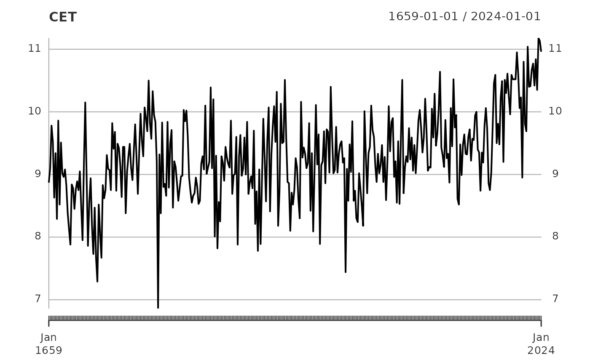
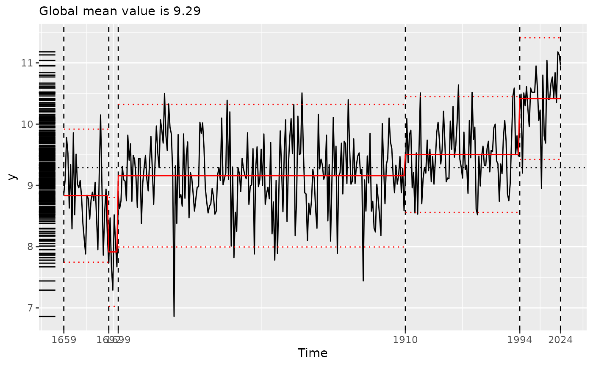
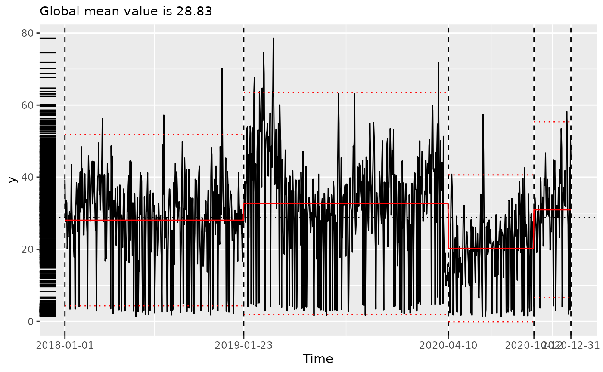

# Climate data in tidychangepoint

The `tidychangepoint` package (Baumer and Suarez Sierra 2024) provides
three climate-related time series.

``` r
library(tidychangepoint)
```

### Central England Temperature

Shi et al. (2022) use changepoint detection algorithms to analyze a time
series of annual temperature data from Central England. These data are
available via `CET` from `tidychangepoint`.

These data go back to 1659, and a simple plot illustrates the increase
in temperature in recent years.

``` r
plot(CET)
```



Shi et al. (2022) use a genetic algorithm to identify changepoints in
this time series. The code below reproduces this analysis. Note that
since the genetic algorithm is random, results vary. Shi, et al. used a
`maxiter` value of 50,000 in order to obtain the results used in the
paper. Here, we use a much lower value solely in the interest of
computational speed. Note that this algorithm is fitting a “meanshift”
model, which estimates the mean $\mu_{i}$ for each of the regions
defined by the changepoint set. The objective function employs the `BIC`
penalty. One departure from Shi’s implementation is the use of the
[`log_gabin_population()`](https://beanumber.github.io/tidychangepoint/reference/build_gabin_population.md)
function to generate the first generation of 200 (i.e. `popSize`)
possible changepoint sets. Each data point is chosen uniformly at random
with probability equal to $\ln N$, where $N$ is the number of
observations (362, in this case).

``` r
trend_wn <- CET |>
  segment(
    method = "ga", 
    model_fn = fit_meanshift_norm, 
    penalty_fn = BIC, 
    population = log_gabin_population(CET),
    popSize = 200, 
    maxiter = 50,
    run = 10
  )
```

    ## Seeding initial population with probability: 0.0161274134792387

Compare this with the changepoint set discovered by the algorithm:

``` r
changepoints(trend_wn)
```

    ##  x34  x42 x269 x336 
    ##   34   42  269  336

``` r
changepoints(trend_wn, use_labels = TRUE) |>
  as_year()
```

    ## [1] "1692" "1700" "1927" "1994"

The
[`fitness()`](https://beanumber.github.io/tidychangepoint/reference/fitness.md)
function returns a named vector with the value of the objective function
from the discovered changepoint set.

``` r
fitness(trend_wn)
```

    ##      BIC 
    ## 667.6336

Information about the regions, including their means, are shown by the
[`tidy()`](https://generics.r-lib.org/reference/tidy.html) function.

``` r
tidy(trend_wn)
```

    ## Registered S3 method overwritten by 'tsibble':
    ##   method               from 
    ##   as_tibble.grouped_df dplyr

    ## # A tibble: 5 × 9
    ##   region    num_obs   min   max  mean    sd begin   end param_mu
    ##   <chr>       <int> <dbl> <dbl> <dbl> <dbl> <dbl> <dbl>    <dbl>
    ## 1 [1,34)         33  7.86 10.2   8.83 0.554     1    34     8.83
    ## 2 [34,42)         8  7.29  8.83  8.03 0.531    34    42     8.03
    ## 3 [42,269)      227  6.86 10.5   9.18 0.592    42   269     9.18
    ## 4 [269,336)      67  8.52 10.6   9.54 0.464   269   336     9.54
    ## 5 [336,367)      31  8.95 11.2  10.4  0.507   336   367    10.4

By default,
[`glance()`](https://generics.r-lib.org/reference/glance.html) returns a
summary of the **segmenter** that produced the discovered changepoint
set. This includes the fitness, the elapsed time, and the parameters
used by the segmenter.

``` r
glance(trend_wn)
```

    ## # A tibble: 1 × 8
    ##   pkg   version    algorithm seg_params model_name criteria fitness elapsed_time
    ##   <chr> <pckg_vrs> <chr>     <list>     <chr>      <chr>      <dbl> <drtn>      
    ## 1 GA    3.2.5      Genetic   <list [1]> meanshift… BIC         668. 8.616 secs

However, we can also run
[`glance()`](https://generics.r-lib.org/reference/glance.html) on the
model resulting from the discovered changepoint set. This provides
information about the model and its fit, including the values of various
alternative model fitting metrics.

It is important to note that only one of these metrics (in this case,
BIC) is actually the one used by the segmenter!

``` r
trend_wn |>
  as.model() |>
  glance()
```

    ## # A tibble: 1 × 11
    ##   pkg     version algorithm params num_cpts  rmse logLik   AIC   BIC  MBIC   MDL
    ##   <chr>   <pckg_> <chr>     <list>    <int> <dbl>  <dbl> <dbl> <dbl> <dbl> <dbl>
    ## 1 tidych… 1.0.3   meanshif… <dbl>         4 0.556  -304.  629.  668.  669.  678.

The [`plot()`](https://rdrr.io/r/graphics/plot.default.html) function
returns an informative plot of the original time series, with the
changepoint set and the corresponding regions demarcated.

``` r
plot(trend_wn, use_time_index = TRUE)
```

    ## Scale for x is already present.
    ## Adding another scale for x, which will replace the existing scale.



#### Comparison to reported values

The changepoint set reported by Shi et al. (2022) is
$\{ 1700,1739,1988\}$. For that configuration with the trendshift model
with white noise errors, Table 2 of Shi et al. (2022) reports model
variance ${\widehat{\sigma}}^{2}$ of 0.291, a log-likelihood of -290.02,
BIC of 650.74, and MDL of 653.07.

Fitting the trendshift model with white noise errors and running the
[`glance()`](https://generics.r-lib.org/reference/glance.html) function
reveals an exact match to the reported figures.

``` r
target_cpts <- c(1700, 1739, 1988)
ids <- time2tau(target_cpts, as_year(time(CET)))
CET |>
  fit_trendshift(tau = ids) |>
  glance()
```

    ## # A tibble: 1 × 11
    ##   pkg     version algorithm params num_cpts  rmse logLik   AIC   BIC  MBIC   MDL
    ##   <chr>   <pckg_> <chr>     <list>    <int> <dbl>  <dbl> <dbl> <dbl> <dbl> <dbl>
    ## 1 tidych… 1.0.3   trendshi… <dbl>         3 0.538  -292.  608.  655.  630.  658.

Modifying the model to incorporate AR(1) lagged errors also matches the
figures from Table 2.

``` r
CET |>
  fit_trendshift_ar1(tau = ids) |>
  glance()
```

    ## # A tibble: 1 × 11
    ##   pkg     version algorithm params num_cpts  rmse logLik   AIC   BIC  MBIC   MDL
    ##   <chr>   <pckg_> <chr>     <list>    <int> <dbl>  <dbl> <dbl> <dbl> <dbl> <dbl>
    ## 1 tidych… 1.0.3   trendshi… <dbl>         3 0.537  -291.  608.  658.  628.  661.

### Bogotá particulate matter

The `bogota_pm` data set contains daily measurement on particulate
matter in Bogotá, Colombia over the three-year period from 2018–2020.

``` r
plot(bogota_pm)
```


Here, we use the genetic algorithm from Taimal, Suárez-Sierra, and
Rivera (2023) to identify changepoint sets. Note that the model being
fit here is the NHPP model, along with the BMDL penalty function.

``` r
bog_cpt <- bogota_pm |>
  segment(
    method = "ga-coen",
    maxiter = 50,
    run = 10
  )
```

    ## Seeding initial population with probability: 0.0145985401459854

``` r
glance(bog_cpt)
```

    ## # A tibble: 1 × 8
    ##   pkg   version    algorithm seg_params model_name criteria fitness elapsed_time
    ##   <chr> <pckg_vrs> <chr>     <list>     <chr>      <chr>      <dbl> <drtn>      
    ## 1 GA    3.2.5      Genetic   <list [1]> nhpp       BMDL       1988. 26.137 secs

``` r
plot(bog_cpt, use_time_index = TRUE)
```

    ## Scale for x is already present.
    ## Adding another scale for x, which will replace the existing scale.



We compare the quality of the fit of the NHPP model using
[`diagnose()`](https://beanumber.github.io/tidychangepoint/reference/diagnose.md).

``` r
bog_cpt |>
  as.model() |>
  diagnose()
```

    ## Warning: Removed 1 row containing missing values or values outside the scale range
    ## (`geom_vline()`).


### Medellín rainfall

The times series `mde_rain_monthly` contains monthly precipitation
readings from locations in and around the city of Medellín, Colombia.

``` r
plot(mde_rain_monthly)
```


Here, we fit the deterministic PELT algorithm (Killick and Eckley 2014).

``` r
mde_cpt <- segment(mde_rain_monthly, method = "pelt")
```

``` r
plot(mde_cpt, use_time_index = TRUE)
```

    ## Scale for x is already present.
    ## Adding another scale for x, which will replace the existing scale.


## References

Baumer, Benjamin S., and Biviana Marcela Suarez Sierra. 2024.
“Tidychangepoint: A Unified Framework for Analyzing Changepoint
Detection in Univariate Time Series.”
<https://beanumber.github.io/changepoint-paper/>.

Killick, Rebecca, and Idris A. Eckley. 2014. “changepoint: An R Package
for Changepoint Analysis.” *Journal of Statistical Software* 58 (3):
1–19. [10.18637/jss.v058.i03](https://10.18637/jss.v058.i03).

Shi, Xueheng, Claudie Beaulieu, Rebecca Killick, and Robert Lund. 2022.
“Changepoint Detection: An Analysis of the Central England Temperature
Series.” *Journal of Climate* 35 (19): 6329–42.
<https://doi.org/10.1175/JCLI-D-21-0489.1>.

Taimal, Carlos A, Biviana Marcela Suárez-Sierra, and Juan Carlos Rivera.
2023. “An Exploration of Genetic Algorithms Operators for the Detection
of Multiple Change-Points of Exceedances Using Non-Homogeneous Poisson
Processes and Bayesian Methods.” In *Colombian Conference on Computing*,
230–58. Springer. <https://doi.org/10.1007/978-3-031-47372-2_20>.
