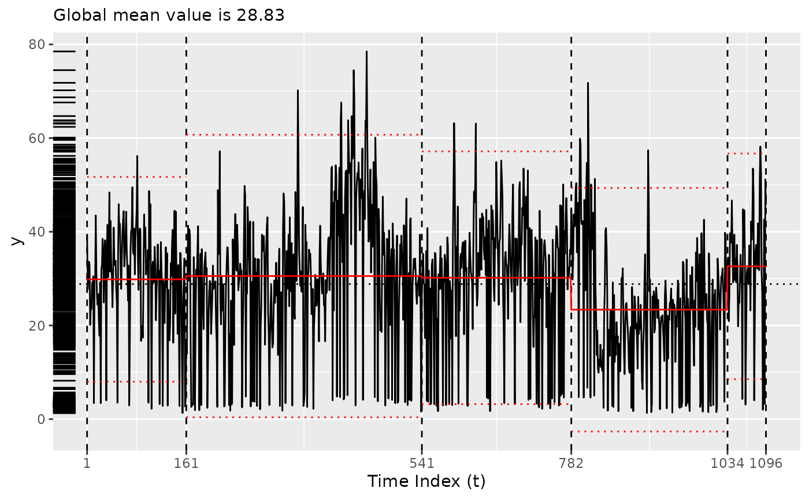
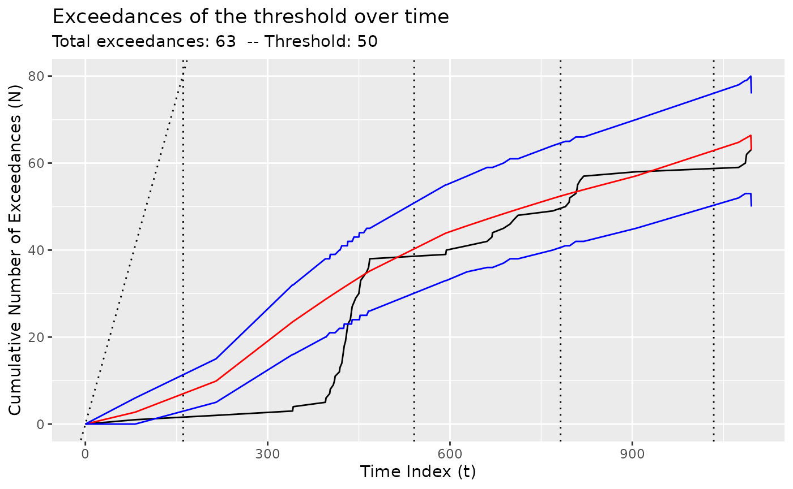

# Using Coen's algorithm

Please see Baumer and Suarez Sierra (2024) for more details.

``` r
library(tidychangepoint)
```

``` r
plot(bogota_pm)
```


## Using the original implementation of Coen’s algorithm

``` r
x <- segment(bogota_pm, method = "coen", num_generations = 5)
#> Warning: `segment_coen()` was deprecated in tidychangepoint 0.0.1.
#> ℹ Please use `segment_ga_coen()` instead.
#> ℹ The deprecated feature was likely used in the tidychangepoint package.
#>   Please report the issue to the authors.
#> This warning is displayed once every 8 hours.
#> Call `lifecycle::last_lifecycle_warnings()` to see where this warning was
#> generated.
#>   |                                                                    |                                                            |   0%  |                                                                    |===============                                             |  25%  |                                                                    |==============================                              |  50%  |                                                                    |=============================================               |  75%  |                                                                    |============================================================| 100%
changepoints(x)
#> [1]  306  491  612  708  739  773 1033
plot(x)
#> Registered S3 method overwritten by 'tsibble':
#>   method               from 
#>   as_tibble.grouped_df dplyr
```


## Using the GA implementation of Coen’s algorithm

``` r
y <- segment(bogota_pm, method = "ga-coen", maxiter = 50, run = 10)
#> Seeding initial population with probability: 0.0145985401459854
changepoints(y)
#> named integer(0)
plot(y)
```


``` r
diagnose(y$model)
#> Warning: Removed 1 row containing missing values or values outside the scale range
#> (`geom_vline()`).
```


``` r
tidy(y)
#> # A tibble: 1 × 12
#>   region      num_obs   min   max  mean    sd begin   end param_alpha param_beta
#>   <chr>         <int> <dbl> <dbl> <dbl> <dbl> <dbl> <dbl>       <dbl>      <dbl>
#> 1 [1,1.1e+03)    1096   1.3  78.5  28.8  14.1     1  1097       0.879      0.758
#> # ℹ 2 more variables: logPost <dbl>, logLik <dbl>
glance(y)
#> # A tibble: 1 × 8
#>   pkg   version    algorithm seg_params model_name criteria fitness elapsed_time
#>   <chr> <pckg_vrs> <chr>     <list>     <chr>      <chr>      <dbl> <drtn>      
#> 1 GA    3.2.4      Genetic   <list [1]> nhpp       BMDL       1918. 30.02 secs
```

### Changing the threshold

By default, the threshold is set to the mean of the observed values, but
it can be changed using the `model_fn_args` argument to
[`segment()`](https://beanumber.github.io/tidychangepoint/reference/segment.md).

Please note that the number of iterations (`maxiter`) of the genetic
algorithm has been set very low here for ease of compilation. **NOTA
BENE**: To obtain more robust result, set `maxiter` to be something much
higher. You can also experiment with the `popSize` argument to
[`segment()`](https://beanumber.github.io/tidychangepoint/reference/segment.md).

``` r
z <- segment(
  bogota_pm, 
  method = "ga-coen", 
  maxiter = 5,
  model_fn_args = list(threshold = 50)
)
#> Seeding initial population with probability: 0.0145985401459854
changepoints(z)
#>  x161  x541  x782 x1034 
#>   161   541   782  1034
plot(z)
```



``` r
diagnose(z$model)
#> Warning: Removed 1 row containing missing values or values outside the scale range
#> (`geom_vline()`).
```



``` r
tidy(z)
#> # A tibble: 5 × 12
#>   region      num_obs   min   max  mean    sd begin   end param_alpha param_beta
#>   <chr>         <int> <dbl> <dbl> <dbl> <dbl> <dbl> <dbl>       <dbl>      <dbl>
#> 1 [1,161)         160   1.3  56.2  29.8  11.2     1   161       0.149     0.0970
#> 2 [161,541)       380   1.6  78.5  30.5  15.4   161   541       0.581     0.314 
#> 3 [541,782)       241   1.7  63.2  30.2  13.8   541   782       0.467     0.0864
#> 4 [782,1.03e…     252   1.3  71.8  23.4  13.3   782  1034       0.452     0.0707
#> 5 [1.03e+03,…      63   2    58.2  32.6  12.3  1034  1097       0.536     0.0818
#> # ℹ 2 more variables: logPost <dbl>, logLik <dbl>
glance(z)
#> # A tibble: 1 × 8
#>   pkg   version    algorithm seg_params model_name criteria fitness elapsed_time
#>   <chr> <pckg_vrs> <chr>     <list>     <chr>      <chr>      <dbl> <drtn>      
#> 1 GA    3.2.4      Genetic   <list [1]> nhpp       BMDL        609. 4.472 secs
```

Baumer, Benjamin S., and Biviana Marcela Suarez Sierra. 2024.
“Tidychangepoint: A Unified Framework for Analyzing Changepoint
Detection in Univariate Time Series.”
<https://beanumber.github.io/changepoint-paper/>.
