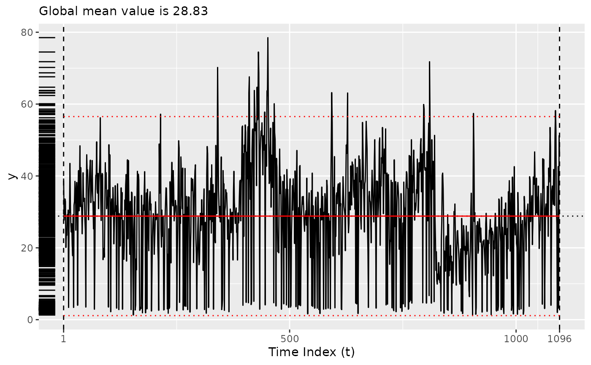

# Using Coen's algorithm

Please see Baumer and Suarez Sierra (2024) for more details.

``` r
library(tidychangepoint)
```

``` r
plot(bogota_pm)
```


## Using the original implementation of Coen’s algorithm

``` r
x <- segment(bogota_pm, method = "coen", num_generations = 5)
#> Warning: `segment_coen()` was deprecated in tidychangepoint 0.0.1.
#> ℹ Please use `segment_ga_coen()` instead.
#> ℹ The deprecated feature was likely used in the tidychangepoint package.
#>   Please report the issue to the authors.
#> This warning is displayed once per session.
#> Call `lifecycle::last_lifecycle_warnings()` to see where this warning was
#> generated.
#>   |                                                                    |                                                            |   0%  |                                                                    |===============                                             |  25%  |                                                                    |==============================                              |  50%  |                                                                    |=============================================               |  75%  |                                                                    |============================================================| 100%
changepoints(x)
#> [1]  306  491  612  708  739  773 1033
plot(x)
#> Registered S3 method overwritten by 'tsibble':
#>   method               from 
#>   as_tibble.grouped_df dplyr
```


## Using the GA implementation of Coen’s algorithm

``` r
y <- segment(bogota_pm, method = "ga-coen", maxiter = 50, run = 10)
#> Seeding initial population with probability: 0.0145985401459854
changepoints(y)
#>  x842 x1039 
#>   842  1039
plot(y)
```



``` r
diagnose(y$model)
#> Warning: Removed 1 row containing missing values or values outside the scale range
#> (`geom_vline()`).
```


``` r
tidy(y)
#> # A tibble: 3 × 12
#>   region      num_obs   min   max  mean    sd begin   end param_alpha param_beta
#>   <chr>         <int> <dbl> <dbl> <dbl> <dbl> <dbl> <dbl>       <dbl>      <dbl>
#> 1 [1,842)         841   1.3  78.5  30.4  14.4     1   842       0.955     1.21  
#> 2 [842,1.04e…     197   1.3  57.4  20.9  10.4   842  1039       0.624     0.105 
#> 3 [1.04e+03,…      58   2    58.2  32.8  12.7  1039  1097       0.729     0.0735
#> # ℹ 2 more variables: logPost <dbl>, logLik <dbl>
glance(y)
#> # A tibble: 1 × 8
#>   pkg   version    algorithm seg_params model_name criteria fitness elapsed_time
#>   <chr> <pckg_vrs> <chr>     <list>     <chr>      <chr>      <dbl> <drtn>      
#> 1 GA    3.2.5      Genetic   <list [1]> nhpp       BMDL       1934. 36.638 secs
```

### Changing the threshold

By default, the threshold is set to the mean of the observed values, but
it can be changed using the `model_fn_args` argument to
[`segment()`](https://beanumber.github.io/tidychangepoint/reference/segment.md).

Please note that the number of iterations (`maxiter`) of the genetic
algorithm has been set very low here for ease of compilation. **NOTA
BENE**: To obtain more robust result, set `maxiter` to be something much
higher. You can also experiment with the `popSize` argument to
[`segment()`](https://beanumber.github.io/tidychangepoint/reference/segment.md).

``` r
z <- segment(
  bogota_pm, 
  method = "ga-coen", 
  maxiter = 5,
  model_fn_args = list(threshold = 50)
)
#> Seeding initial population with probability: 0.0145985401459854
changepoints(z)
#>  x295  x334  x488  x554  x646  x754  x844  x973 x1093 
#>   295   334   488   554   646   754   844   973  1093
plot(z)
```


``` r
diagnose(z$model)
#> Warning: Removed 1 row containing missing values or values outside the scale range
#> (`geom_vline()`).
```


``` r
tidy(z)
#> # A tibble: 10 × 12
#>    region     num_obs   min   max  mean    sd begin   end param_alpha param_beta
#>    <chr>        <int> <dbl> <dbl> <dbl> <dbl> <dbl> <dbl>       <dbl>      <dbl>
#>  1 [1,295)        294   1.3  57.2  28.1 12.1      1   295       0.181     0.108 
#>  2 [295,334)       39   1.8  48.2  25.9 11.9    295   334       0.251     0.0872
#>  3 [334,488)      154   2.2  78.5  36.8 17.0    334   488       0.617     0.115 
#>  4 [488,554)       66   1.6  47.1  26.7 12.4    488   554       0.240     0.0864
#>  5 [554,646)       92   1.7  63.2  29.7 13.4    554   646       0.434     0.0839
#>  6 [646,754)      108   1.7  55.2  31.2 13.9    646   754       0.498     0.0799
#>  7 [754,844)       90   1.8  71.8  31.3 16.6    754   844       0.544     0.0810
#>  8 [844,973)      129   1.3  57.4  19.4  9.68   844   973       0.342     0.0846
#>  9 [973,1.09…     120   1.5  58.2  27.8 12.4    973  1093       0.461     0.0848
#> 10 [1.09e+03…       4   3.2  51.2  35.7 21.9   1093  1097       0.639     0.0775
#> # ℹ 2 more variables: logPost <dbl>, logLik <dbl>
glance(z)
#> # A tibble: 1 × 8
#>   pkg   version    algorithm seg_params model_name criteria fitness elapsed_time
#>   <chr> <pckg_vrs> <chr>     <list>     <chr>      <chr>      <dbl> <drtn>      
#> 1 GA    3.2.5      Genetic   <list [1]> nhpp       BMDL        654. 4.982 secs
```

Baumer, Benjamin S., and Biviana Marcela Suarez Sierra. 2024.
“Tidychangepoint: A Unified Framework for Analyzing Changepoint
Detection in Univariate Time Series.”
<https://beanumber.github.io/changepoint-paper/>.
